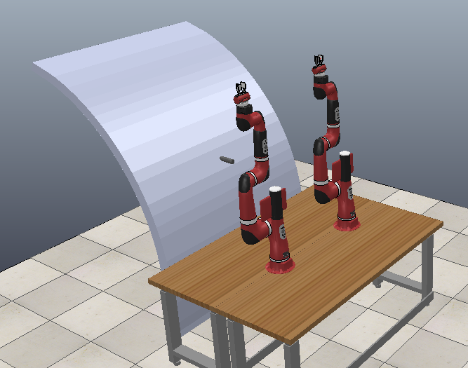
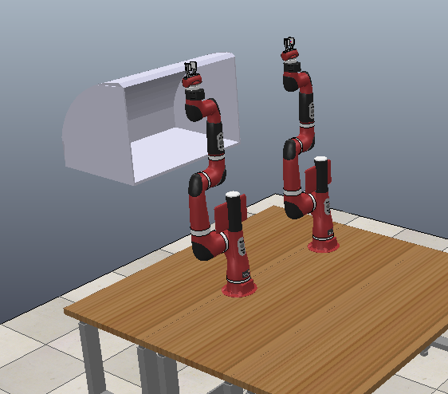
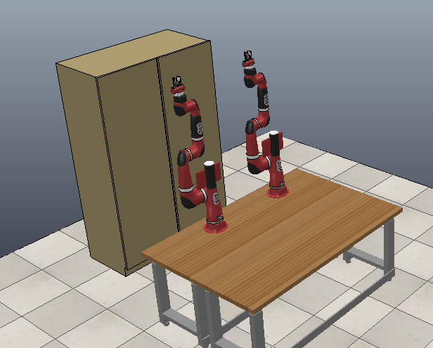
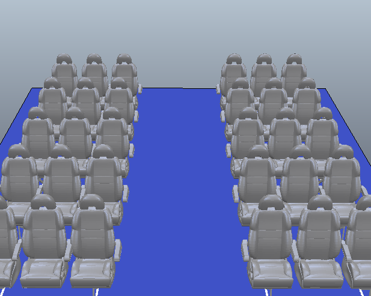

# CoppeliaSim Scenes

---
## Basic Scenes
### [Airplane Body](basic_scenes/mimicry_camera_airplane_body.ttt)

### [Box](basic_scenes/mimicry_camera_box.ttt)

### [Overhead Bin](basic_scenes/mimicry_camera_overhead.ttt)

### [Shelf](basic_scenes/mimicry_camera_shelf.ttt)

 

---
## Environment Scenes
### [Airplane](environments/airplane.ttt)

### [Library](environments/library.ttt)

 

---
## Multicamera Scenes

